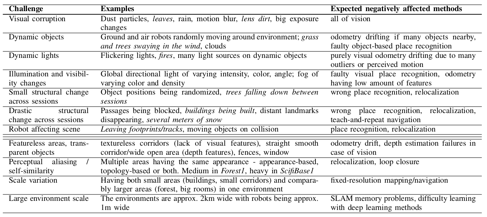

## HARDNAV - Introduction
Hi! Thank you for showing interest in our simulator! The full name of the (currently) workshop paper is [**"HARDNAV - Simulator for Benchmarking Robust Navigation and Place Recognition in Large, Confusing and Highly Dynamic Environments"**](https://drive.google.com/drive/folders/1P0P6gtV69hoTc37NbpVFxB2imXVYpxip). We hope this simulator can help you quickly test your robust perception and spatial intelligence methods against the varying, often extreme conditions that can occur in the real world before doing costly real world experiments. **Any feedback is greatly appreciated!** Please send any issues or ideas for improvements to musilto8@fel.cvut.cz

Quick showcase of the simulator:

## Dependencies
ROS Dependencies:
- [ROS-TCP-Endpoint ROS package](https://github.com/Unity-Technologies/ROS-TCP-Endpoint) - needed on the ROS side to connect to Unity.
  
Unity packages/assets (not needed if you use the executable, only if you want to edit the project in the Unity Editor, add your own features etc.):
- [Robotics Unity package](https://github.com/Unity-Technologies/ROS-TCP-Connector) - is complementary to the ROS-TCP-Endpoint ROS node. Installation tutorial under the Unity Setup section [here](https://github.com/Unity-Technologies/Unity-Robotics-Hub/blob/main/tutorials/ros_unity_integration/setup.md).
- [YamlDotNet](https://assetstore.unity.com/packages/tools/integration/yamldotnet-for-unity-36292) - needed for using YAML to reconfigure the world, project will not compile without it
- [DreamForestTree](https://assetstore.unity.com/packages/3d/vegetation/trees/dream-forest-tree-105297) - contains trees, vegetation and ground textures used in Forest1 and ground texture for ScifiBase1. You might want to add colliders to the trees, as they dont have them by default in the package.
- [Yughues Free Metal Materials](https://assetstore.unity.com/packages/2d/textures-materials/metals/yughues-free-metal-materials-12949) - very nice materials used for most objects in the simulator, and also for reflective and transparent walls

## Setting up the Simulator
To use the HARDNAV simulator, there are two options:
- A) You can download one of the executable builds at the bottom of the readme,
- B) Or, to make modifications to the existing worlds, create new ones or add your own features/robots into the worlds, you can download the Unity Hub from https://unity.com/download and open the "navigation_unity_project" folder as a Unity project. This will require importing the assets mentioned in the Dependencies section.
 
For option A, please skip to section 3 of getting started. 

### 1) Installing Unity Hub and the Robotics package into Unity Editor
If you haven't already, install Unity Hub, open the navigation_unity_project with it, and download the corresponding version of Unity when prompted. After that, install the [Robotics Unity package](https://github.com/Unity-Technologies/ROS-TCP-Connector). it is complementary to the ROS-TCP-Endpoint ROS package and is needed on the side of Unity to make the connect Unity to ROS. The instructions for installing it into Unity can be found [here](https://github.com/Unity-Technologies/Unity-Robotics-Hub/blob/main/tutorials/ros_unity_integration/setup.md).

### 2) Importing other required packages to the Unity project
When you open navigation_unity_project in the Unity editor, it will contain compilation erros, since some scripts require the YamlDotnet package, which due to licensing issues, cannot be included in this repo and must be downloaded from the Unity Asset Store. Open the project in safe mode or ignore the warning, then add the assets mentioned in the Dependencies section to your Unity account, open the package manager in the Unity editor (the Window->Package Manager tab) and import all the assets into the project. The compilation errors should then disappear and the game should be runnable. Open any world in the Scenes folder and enjoy!

### 3) Building ROS-TCP-Endpoint package
The simulator (either running as executable or run by pressing play in the Unity editor) connects to ROS automatically if there is a [ROS TCP Endpoint node](https://github.com/Unity-Technologies/ROS-TCP-Endpoint) running along with the Unity game, and there is an active ROS publisher/subscriber node in Unity. If the icon in the top left corner of the Unity game screen is blue, Unity is connected to ROS. Please, download the [ROS TCP Endpoint package](https://github.com/Unity-Technologies/ROS-TCP-Endpoint), add it to your workspace and build it. You can launch it through endpoint.launch in the ros_tcp_endpoint package or by launching core_nodes.launch in navigation_unity_core package in this repo (which now contains only the endpoint).

### 4) Building navigation_unity_core and navigation_unity_msgs ROS packages 
To use the scripts provided in the repo and also to enable the ResetWorld.srv ROS service, put your navigation_unity_core and navigation_unity_msgs folders to the src folder of your ROS workspace and build them. If you wish to implement new custom message types, then you need to compile them, source your workspace, and then in Unity Editor, go to Robotics->Generate ROS Messages tab

### 5) Resetting world state through python script
To play around with changing the world settings, you can run the "session_cycler.py" ROS node for showcasing changes of 4 world states, as shown in the video above, or run "place_recognition_from_motion_trial.py" for an example of how an active place recognition trial could work (you can test it on willing human subjects - tell them to try recognizing which area they are spawned in!). You can use these as examples to design your own experiments for developing and benchmarking robust vision-based spatial intelligence methods :)

## State of the project
### Sensors and robot models
Available:
- IMUROSPublisher.cs script for turning any GameObject with a Rigidbody intu an IMU sensor with gaussian noise
- RGBCameraROSPublisher.cs script for turning any camera in Unity into a camera that publishes data into ROS
- ROSSIngleTransformPublisher.cs script for publishing ground-truth pose for debugging and evaluating methods (a transform is published between the robot and its last spawnpoint, and also between the robot and the world coodinate frame origin)
- 2 available simplified robots - "generic_wheeled" robot with wheels and a car-like controller, and a "generic_space" (also called underwater in the project) robot which is fully velocity/force controlled (through Twist messages) and has gravity disabled
- URDF importing of other robots is possible through the [URDF-Importer](https://github.com/Unity-Technologies/URDF-Importer) package, but is untested as of now.
  
In progress:
- depth cameras, ultrasound rangefinder, fixing generic_wheeled robot ROS control
### Coming soon
- Importing the Jackal ground robot with the Unity URDF importer and a tutorial on importing additional robots - Expected towards the end of October 2023.
- Adding a replicable benchmark of robust vision-based navigation, as proposed in the [workshop paper](https://drive.google.com/drive/folders/1P0P6gtV69hoTc37NbpVFxB2imXVYpxip) - Expected towards the end of November 2023.
- Procedural generation of forest / alien planet environments - Expected November 2023.
- Comparison of state-of-the-art SLAM and visual place recognition algorithms on the simulated extreme conditions - Expected December 2023

### Challenges for robustness
The ones in normal text are available through the simulator in some way, the ones in italics are planned:

### Known issues
- There is some issue with post-processing motion blur when doing manual render calls, in which the output ROS image is blurred too much, if the camera component is not active. However, if it is active, Unity seems to also render the camera on its own along with the manual render calls. Therefore, motion blur is now disabled for the ROS image data. Bloom works.
- Large difference between realtime factor when running the game in the Editor and when running the built version (getting RTF of ~1.0 in the forest when the debug camera is disabled in Editor,but in the build, the RTF does not improve when debug cam is disabled in the built game and stays around 0.6 on a standard laptop). It's likely a problem with some project settings and timestep configuration.

## Builds
Build 1.0 for Linux can be downloaded [here](https://nasmrs.felk.cvut.cz/index.php/s/pb72nPHCTmn9cF2). On startup, it will load up a "generic_space" robot with a monocular camera in the "forest1" scene. To change the scenes, modify the config file "ros_packages/navigation_unity_core/unity_world_config/default.yaml" and then apply it by running "rosrun navigation_unity_core default_world_loader.py". Any feedback is welcome!
